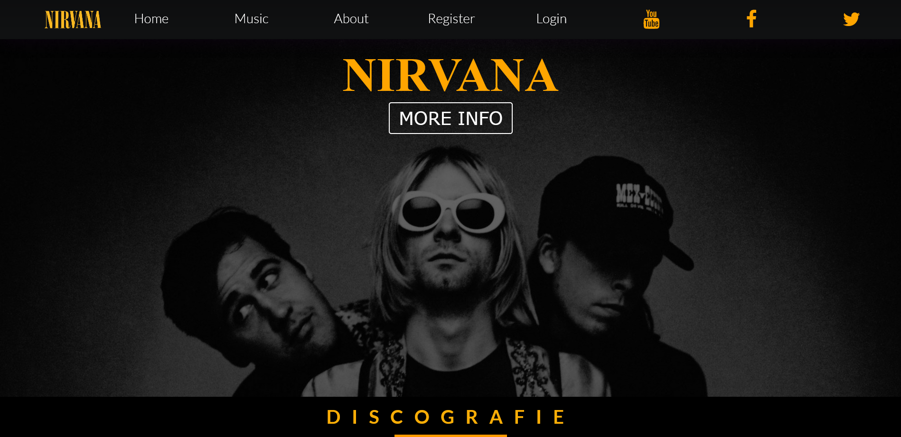

# NirvanaFanPage
<h3>This is a fanmade website for Nirvana </h3>
<hr>

# websocket-node.js

## What is it ?
ws is a simple to use, blazing fast, and thoroughly tested WebSocket client and server implementation.
<hr>

## Installing
```npm install ws```

<hr>

### Build with
<ol>
<li>JS(node.js)
<li>HTML
<li>CSS
</ol>

## Screenshots



